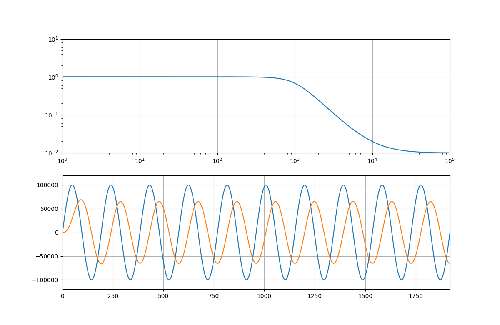

An FPGA project that samples in I2S audio, applies some filters, including 2 biquad filters, and outputs it to I2S again.
An I2S cs4270 ADC/DAC is used in stand alone mode, in master using I2S. This I2S ADC/DAC is chosen because I had a XMOS Audio SliceCARD laying around, which has 2 of these on board :')
The cs4270 is connected to the JB and JC headers on an Digilent Arty A7 with a bodge PCB, but it works.

As calculating the coefficients for a biquad filter is boring and annoying, a C++ program is used to calculate these.
The code for this is in the SW directory and is build with the make command.
It uses matplotlib-cpp for making nice plots, so a few dependencies are needed, information about these and about matplotlib can be found here: https://github.com/lava/matplotlib-cpp
To calculate a filter, the build binary is executed from command line with a few parameters:
Usage: ./biquad (lpf/hpf/bps/notch/peak/hsh/lsh),  filter freq in Hz, order, gain, type(sine/triangle/square), test freq in Hz, test periods

The filters possible are a LowPassFilter(LPF), HighPassFilter(HPF), Notch, Peak, HighSHelf(HSH) and LowSHelft(LSH), The filter frequency is a value between 1 and 96000, as the ADC/DAC run at 192Khz. The filter order is 2 or higher, a 2 order filter is recommended in most scenarios. gain is only needed for the HSH and LSH filter. 
To show the effect of the filter, a type of signal is chosen, sine, triangle or square, as well as the frequency of this signal and how many periods are displayed.
For example, for a 1Khz LowPassFilter, with a 1Khz sine test signal the command would be:
./biquad lpf 1000 2 0 sine 1000 10
The 5 coefficients are outputted in the terminal:
111, 223, 111, ffe0c889, f3bbf

and a window with the filter and sine wave with filter applied are shown:

The VHDL sourcecode can be found in the RTL folder and a complete Vivado project in the Vivado folder.
I2STestRik.vhd is the top, I2S_Decoder is a testbench which tests nothing really and is kinda crappy.

All code is licenced GPL 3 unless stated otherwise in the file.
